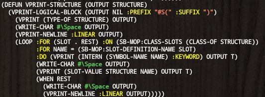

# VIVID-COLORS 2.0.0
## What is this?
Colored object printer.

## Alternatives and differences.
Please tell me if exists.

## Usage

```lisp
* (vprint '(:keyword :keyword
            :character #\A
	    :string "string"
	    :number 1/3
	    :pathname #P"foo/bar"))
```


```lisp
* (vprint '(defun vprint-structure (output structure)
             (vprint-logical-block (output nil :prefix "#S(" :suffix ")")
               (vprint (type-of structure) output t)
               (write-char #\Space output)
               (vprint-newline :linear output)
               (loop :for (slot . rest) :on (c2mop:class-slots (class-of structure))
                     :for name = (c2mop:slot-definition-name slot)
                     :do (vprint (intern (symbol-name name) :keyword) output t)
                         (write-char #\Space output)
                         (vprint (slot-value structure name) output t)
                         (when rest
                           (write-char #\Space output)
                           (vprint-newline :linear output))))))
```


## How to extend.
Ideally, I want to use a pretty-printing system for this coloring feature but
it does not match for this purpose because

1. Pretty printer counts escape sequence length too. (Indentation will be broken.)
2. Pretty printing system does not provide ways to customizing. (especially the way to supersede the class for pretty-printing streams.)

In other words, at least I am satisfied with pretty-printing API.
So vivid-colors APIs are designed almost the same with common lisp pretty printing APIs.

For detailed examples, see [source code](src/vivid-colors.lisp).

A tiny example to print the common lisp symbols as blue is bellow.

```lisp
* (defun vprint-cl-symbol (output symbol)
    (put symbol output :color cl-colors2:+blue+))
VPRINT-CL-SYMBOL

* (handler-bind ((dispatch-key-confliction #'replace-by-new))
    (define-vprint-dispatch blue-cl-symbols
      (:merge :pretty :standard)
      (:set `(member ,@(loop :for s :being :each :external-symbols :of :cl
                             :collect s))
            'vprint-cl-symbol)))
BLUE-CL-SYMBOLS

* (in-vprint-dispatch blue-cl-symbols)
#<VPRINT-DISPATCH BLUE-CL-SYMBOLS entry 19>

* (vprint '(defun vprint-structure (output structure)
             (vprint-logical-block (output nil :prefix "#S(" :suffix ")")
               (vprint (type-of structure) output t)
               (write-char #\Space output)
               (vprint-newline :linear output)
               (loop :for (slot . rest) :on (c2mop:class-slots (class-of structure))
                     :for name = (c2mop:slot-definition-name slot)
                     :do (vprint (intern (symbol-name name) :keyword) output t)
                         (write-char #\Space output)
                         (vprint (slot-value structure name) output t)
                         (when rest
                           (write-char #\Space output)
                           (vprint-newline :linear output))))))
```


### PUT vs VPRINT.
`PUT` is used to control atomic representation coloring.
'Atomic representation' is roughly the representation that is
not changed its representation by the variable `CL:*PRINT-PRETTY*`
e.g. `symbol`, `character`, `number`, `pathname` or `string`.

For controlling the non-atomic representation coloring,
you need to use `VPRINT` with binding the variable `*COLOR*`.

If you do not control coloring (i.e. using global one), use `VPRINT`.

## From developer

### Product's goal

### License
MIT

### Developed with
SBCL

### Tested with
* SBCL/2.1.7
* CCL/1.12.1
* ECL/21.2.1 ; See [queue](queue/README.md) and/or [dispatch](dispatch/README.md).
* CLISP/2.49
* Allegro/10.1
* CMUCL/21D ; Failed. See [content](content/README.md).
* ABCL/1.8.0 ; See [queue](queue/README.md) and/or [dispatch](dispatch/README.md).

## Installation

